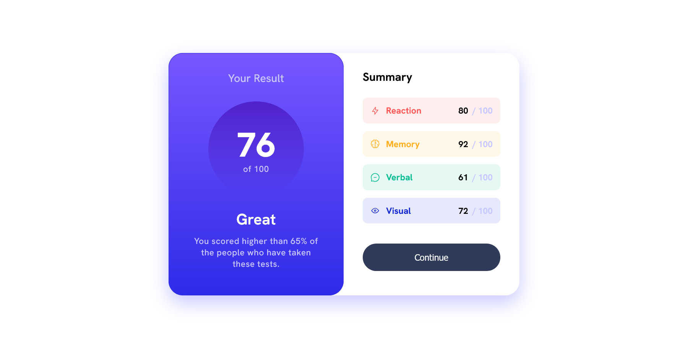

# Frontend Mentor - Results summary component solution

This is a solution to the [Results summary component challenge on Frontend Mentor](https://www.frontendmentor.io/challenges/results-summary-component-CE_K6s0maV).

### Screenshot

### Links

- Solution URL: [Solution URL here](https://www.frontendmentor.io/solutions/results-summary-component-Q0f9Df9gLm)
- Live Site URL: [Live site URL here](https://donjr2.github.io/Frontend-Mentor---Results-summary-component-solution/)

### Built with

- Semantic HTML5 markup
- CSS custom properties
- Flexbox

## Author

- Frontend Mentor - [@Tuhin=jr](https://www.frontendmentor.io/profile/Tuhin=jr)
